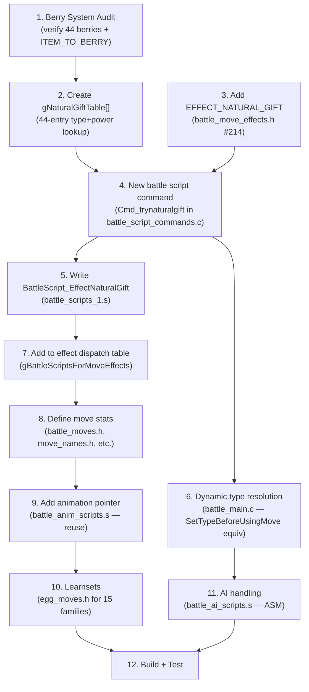

# FireRed Decomp vs pokeemerald-expansion (RHH) — Deep Structural Comparison

Comprehensive comparison for planning move implementation (Natural Gift and beyond). Based on direct analysis of both codebases.

- **FireRed**: `/mnt/data/Github/prototype/firered-romhack-1`
- **Emerald expansion**: `/mnt/data/Github/rh-hideout/pokeemerald-expansion`

---

## 1. Battle AI — The Biggest Structural Gap

| Aspect | FireRed | Emerald Expansion |
|--------|---------|-------------------|
| **Language** | Custom ASM scripting VM | Native C functions |
| **AI logic files** | `data/battle_ai_scripts.s` (3,259 lines ASM) | `src/battle_ai_main.c` (5,423 lines C) |
| **AI interpreter** | `src/battle_ai_script_commands.c` (1,970 lines C — interprets ASM scripts) | N/A — AI runs directly in C |
| **AI utilities** | Embedded in ASM | `src/battle_ai_util.c` (4,006 lines C) |
| **AI switching** | `src/battle_ai_switch_items.c` (shared) | `src/battle_ai_switch_items.c` (2,288 lines) |
| **Total AI code** | ~5,229 lines (ASM+C) | ~11,717 lines (all C) |
| **How effects handled** | `if_effect EFFECT_XYZ, AI_CBM_Handler` (ASM macros) | `case EFFECT_XYZ:` in C switch statements |
| **Available commands** | ~40 ASM macro commands (`if_move`, `if_effect`, `get_ability`, `score`, etc.) | Full C — any logic, any data access |

### Why FireRed uses ASM

FireRed's AI was written before the decomp existed — GameFreak used a bytecode scripting system interpreted at runtime. The `battle_ai_script_commands.c` file is a VM that reads the ASM-encoded scripts and executes commands like `if_effect`, `score`, `get_ability`. This is the **original Gen 3 design**.

### Why Emerald Expansion uses C

RHH rewrote the entire AI as native C functions. Each AI flag (`AI_FLAG_CHECK_BAD_MOVE`, etc.) maps to a C function that receives `(battlerAtk, battlerDef, move, score)` and returns the modified score. This allows arbitrary complexity, access to any game data, and proper debugging.

### Implications for Adding New Move Effects

| Task | FireRed | Emerald |
|------|---------|---------|
| Add AI awareness for new effect | Write ASM using limited macro commands. Must fit within the scripting VM's capabilities. | Add a `case EFFECT_XYZ:` to the C switch. Full language features available. |
| Check held item in AI | Requires specific ASM commands (`get_hold_effect`, etc.) — limited set | Direct C: `gBattleMons[battler].item`, any item logic |
| Complex conditional logic | Painful in ASM — lots of gotos, no local variables | Straightforward C with if/else, loops, local vars |

> [!CAUTION]
> Adding new AI logic for Gen 4+ effects in FireRed means writing ASM scripts with the limited command set, or extending the VM with new commands in `battle_ai_script_commands.c`. This is the single hardest part of move migration.

**Difficulty: 9/10** — Requires ASM knowledge AND understanding of the custom VM.

---

## 2. Battle Scripts (Effect Logic)

| Aspect | FireRed | Emerald Expansion |
|--------|---------|-------------------|
| **File** | `data/battle_scripts_1.s` (4,382 lines) | `data/battle_scripts_1.s` (10,024 lines) |
| **Language** | ASM battle script macros | ASM battle script macros (same system) |
| **Script commands** | `src/battle_script_commands.c` (9,886 lines) | `src/battle_script_commands.c` (17,327 lines) |
| **Effect dispatch** | `gBattleScriptsForMoveEffects` pointer table (214 effects, ends at EFFECT_CAMOUFLAGE) | `gBattleMoveEffects[]` struct array in `battle_move_effects.h` |
| **Effect constants** | `include/constants/battle_move_effects.h` — 214 effects (0–213) | Enum in `include/constants/battle_move_effects.h` — 300+ effects |

### Key Difference: Effect Dispatch Architecture

**FireRed**: `gBattleScriptsForMoveEffects` is a flat `.4byte` pointer table in ASM. Each move's `.effect` is an index into this table. Adding an effect means:
1. Add `#define EFFECT_XYZ N` to `battle_move_effects.h`
2. Add `.4byte BattleScript_EffectXyz` at position N in the pointer table
3. Write the battle script in ASM macros

**Emerald Expansion**: `gBattleMoveEffects[]` is a C struct array where each entry has `.battleScript`, `.battleTvScore`, and flags. Same underlying ASM battle script system, but the dispatch table is cleaner.

### Shared Ground

Both codebases use the **same battle script macro language** (`attackcanceler`, `accuracycheck`, `damagecalc`, `typecalc`, etc.). Battle scripts written for Emerald can often be ported to FireRed with minor adjustments.

**Difficulty: 5/10** — Same scripting language, but FireRed has fewer helper commands.

---

## 3. Move Data Storage

| Aspect | FireRed | Emerald Expansion |
|--------|---------|-------------------|
| **Stats** | `src/data/battle_moves.h` — `gMovesInfo[MOVES_COUNT]` | `src/data/moves_info.h` — `gMovesInfo[]` (22,024 lines, ALL-IN-ONE) |
| **Names** | `src/data/text/move_names.h` — separate file, ALL CAPS, 12 char max | Inline `.name = COMPOUND_STRING(...)` — mixed case, >12 chars supported |
| **Descriptions** | `src/move_descriptions.c` — string + pointer array, offset by -1 | Inline `.description = COMPOUND_STRING(...)` |
| **Flags** | Bitfield: `FLAG_MAKES_CONTACT \| FLAG_PROTECT_AFFECTED \| ...` | Individual booleans: `.makesContact = TRUE`, `.punchingMove = TRUE` |
| **Secondary effects** | `.effect = EFFECT_BURN_HIT` + `.secondaryEffectChance = 10` | `.additionalEffects = ADDITIONAL_EFFECTS({...})` — supports multiple |
| **Category** | `DAMAGE_CATEGORY_PHYSICAL / DAMAGE_CATEGORY_SPECIAL / DAMAGE_CATEGORY_STATUS` | `DAMAGE_CATEGORY_PHYSICAL / ...` |
| **Animation** | Separate `gBattleAnims_Moves` table in `data/battle_anim_scripts.s` | Inline `.battleAnimScript = Move_XYZ` in moves_info |
| **Contest** | No contests in FireRed | Inline `.contestEffect`, `.contestCategory` |
| **Files to edit per move** | **4–6 separate files** | **1 file** (`moves_info.h`) |

### Advantages of Each

| | FireRed (Separated) | Emerald (Unified) |
|--|-------|---------|
| ✅ | Smaller individual files, easier to read | Single source of truth, no index mismatches |
| ✅ | Less chance of merge conflicts in team work | Can't forget a field (compiler catches it) |
| ❌ | Index sync bugs possible (name at wrong slot) | `moves_info.h` is 22K lines, unwieldy |
| ❌ | No compiler enforcement of completeness | Rebuilds slower when any move changes |

**Difficulty: 2/10** — Straightforward mapping. Most fields copy directly.

---

## 4. Battle Animations

| Aspect | FireRed | Emerald Expansion |
|--------|---------|-------------------|
| **File** | `data/battle_anim_scripts.s` (11,099 lines / 406KB) | `data/battle_anim_scripts.s` (34,322 lines / 1.4MB) |
| **Sprite data** | `src/battle_anim_*.c` (type-based files) | Same pattern, more files |
| **Move anim table** | `gBattleAnims_Moves` — `.4byte` per move | Referenced inline in `moves_info.h` |
| **Gen 4+ anims** | Do not exist | Full animations for Gen 4-9 moves |

### Strategy for New Moves

Reuse existing animation pointers initially. Example: point Natural Gift at `Move_HIDDEN_POWER` (similar dynamically-typed attack). Custom animations are the most time-consuming part and can be deferred.

**Difficulty: 2/10** (reuse) → **8/10** (custom animation).

---

## 5. Learnsets & TM Compatibility

| System | FireRed | Emerald Expansion |
|--------|---------|-------------------|
| **Level-up** | Single file: `level_up_learnsets.h`. `LEVEL_UP_MOVE(lvl, move)` macro. **9-bit move ID limit = max 511** | Per-gen files: `gen_1.h` through `gen_9.h`. `struct LevelUpMove` — no ID limit |
| **Egg moves** | `egg_moves.h` — `egg_moves(SPECIES, MOVE1, MOVE2, ...)` | Same format, same file |
| **TM/HM compat** | `tmhm_learnsets.h` — **64-bit bitmask** per species. Max 64 TMs+HMs (58 used) | `teachable_learnsets.h` — flat `u16[]` per species. No limit. Auto-generated |
| **TM/HM list** | `sTMHMMoves[]` + `sTMHMMoves_Duplicate[]` in `party_menu.h` | `FOREACH_TM(F)` / `FOREACH_HM(F)` macros in `tms_hms.h` |

### Critical Limits

| Limit | FireRed | Emerald |
|-------|---------|---------|
| Max move ID | **511** (9-bit learnset encoding) | No hard limit |
| Max TMs+HMs | **64** (bitmask). 58 used, 6 free | Unlimited (flat array) |
| Current move count | 354 | 848+ |
| Room for new moves | ~157 before 511 limit | Plenty |

**Difficulty: 3/10** — Direct copy for egg moves. Level-up is manual but simple.

---

## 6. Berry System — Natural Gift Dependency

| Aspect | FireRed | Emerald Expansion |
|--------|---------|-------------------|
| **Berry count** | 44 (Cheri through Enigma, `NUM_BERRIES` in `berry.h`) | 60+ (adds resist berries: Occa, Passho, etc., plus Roseli, Kee, Maranga) |
| **Berry struct** | `struct Berry` in `global.berry.h` — name, firmness, size, etc. | Same base struct, extended with more data |
| **Berry items** | `ITEM_CHERI_BERRY` through `ITEM_ENIGMA_BERRY` (`FIRST_BERRY_INDEX` / `LAST_BERRY_INDEX`) | Same range + additional berries |
| **`ITEM_TO_BERRY` macro** | `(itemId - FIRST_BERRY_INDEX) + 1` — **EXISTS in both** | Same macro |
| **Natural Gift table** | **Does not exist** | `gNaturalGiftTable[]` in `battle_util.c` — maps each berry to `{type, power}` |
| **Hold effects** | Basic: status cure, stat boost, HP restore | Adds: resist berries, Kee, Maranga, Custap, Jaboca, Rowap, etc. |

### Natural Gift Implementation in Emerald Expansion

The effect touches **3 C files** plus the battle script:

| File | What it does |
|------|-------------|
| `src/battle_util.c` | `gNaturalGiftTable[]` — array of `struct TypePower` mapping each berry to `{type, power}`. Also `CalcMoveBasePower()`: `case EFFECT_NATURAL_GIFT: basePower = gNaturalGiftTable[ITEM_TO_BERRY(item)].power;` |
| `src/battle_main.c` | `SetTypeBeforeUsingMove()`: resolves the berry's type dynamically via `gNaturalGiftTable[ITEM_TO_BERRY(item)].type` and sets `gBattleStruct->dynamicMoveType` |
| `src/battle_ai_main.c` | `case EFFECT_NATURAL_GIFT:` — AI scoring logic |
| `data/battle_scripts_1.s` | `BattleScript_EffectNaturalGift` — the actual battle script (checks if user holds a berry, fails if not, otherwise does damage + consumes berry) |

### What FireRed Needs for Natural Gift

1. **`gNaturalGiftTable[]`** — Create this lookup table. Only needs the 44 berries FireRed has (Cheri→Enigma). Can use `ITEM_TO_BERRY` macro already present.
2. **`EFFECT_NATURAL_GIFT`** constant — Add to `battle_move_effects.h` (ID 214)
3. **Battle script** — Write `BattleScript_EffectNaturalGift` in `battle_scripts_1.s`. Need a new `Cmd_trynaturalgift` or reuse existing commands to check held berry + set type/power.
4. **C handler** — `battle_script_commands.c`: new command to resolve berry type/power at runtime, or piggyback on existing `Cmd_` functions.
5. **Dynamic type resolution** — FireRed's `SetTypeBeforeUsingMove` equivalent is in `battle_main.c`. Need to add Natural Gift type resolution there.
6. **AI** — ASM AI script: at minimum, `if_effect EFFECT_NATURAL_GIFT, AI_CBM_NaturalGift` + handler that checks if user holds a berry.

**Difficulty: 7/10** — Not just "add a move." Requires new battle script command, dynamic type resolution in C, AND ASM AI logic.

---

## 7. Complete File Location Mapping

### Move Definition

| Purpose | FireRed Path | Emerald Path |
|---------|-------------|--------------|
| Move IDs | `include/constants/moves.h` | `include/constants/moves.h` |
| Move effects | `include/constants/battle_move_effects.h` | `include/constants/battle_move_effects.h` |
| Move stats | `src/data/battle_moves.h` | `src/data/moves_info.h` |
| Move names | `src/data/text/move_names.h` | (inline in `moves_info.h`) |
| Move descriptions | `src/move_descriptions.c` | (inline in `moves_info.h`) |

### Battle Engine

| Purpose | FireRed Path | Emerald Path |
|---------|-------------|--------------|
| Battle scripts | `data/battle_scripts_1.s` | `data/battle_scripts_1.s` |
| Script commands (C) | `src/battle_script_commands.c` | `src/battle_script_commands.c` |
| Battle utilities | `src/battle_util.c` | `src/battle_util.c` |
| Main battle loop | `src/battle_main.c` | `src/battle_main.c` |
| Type calc / damage | Inside `battle_script_commands.c` | `src/battle_util.c` (larger, more functions) |
| Effect dispatch | `gBattleScriptsForMoveEffects` in `battle_scripts_1.s` | `gBattleMoveEffects[]` in `src/data/battle_move_effects.h` |

### AI

| Purpose | FireRed Path | Emerald Path |
|---------|-------------|--------------|
| AI logic | `data/battle_ai_scripts.s` (ASM) | `src/battle_ai_main.c` (C) |
| AI VM/interpreter | `src/battle_ai_script_commands.c` | N/A |
| AI utilities | (embedded in ASM) | `src/battle_ai_util.c` |
| AI switching | `src/battle_ai_switch_items.c` | `src/battle_ai_switch_items.c` |
| AI macros | `asm/macros/battle_ai_script.inc` | N/A |

### Animations

| Purpose | FireRed Path | Emerald Path |
|---------|-------------|--------------|
| Anim scripts | `data/battle_anim_scripts.s` (406KB) | `data/battle_anim_scripts.s` (1.4MB) |
| Anim sprite data | `src/battle_anim_*.c` (type-based) | Same pattern |

### Learnsets

| Purpose | FireRed Path | Emerald Path |
|---------|-------------|--------------|
| Level-up | `src/data/pokemon/level_up_learnsets.h` | `src/data/pokemon/level_up_learnsets/gen_*.h` |
| Egg moves | `src/data/pokemon/egg_moves.h` | `src/data/pokemon/egg_moves.h` |
| TM/HM compat | `src/data/pokemon/tmhm_learnsets.h` | `src/data/pokemon/teachable_learnsets.h` |
| TM/HM list | `src/data/party_menu.h` (L970, L1197) | `include/constants/tms_hms.h` |

### Berries / Items

| Purpose | FireRed Path | Emerald Path |
|---------|-------------|--------------|
| Berry data | `src/berry.c` / `include/global.berry.h` | `src/berry.c` / `include/global.berry.h` |
| Item constants | `include/constants/items.h` | `include/constants/items.h` |
| Hold effects | `include/constants/hold_effects.h` | `include/constants/hold_effects.h` |
| Natural Gift table | **does not exist** | `src/battle_util.c` (`gNaturalGiftTable[]`) |

---

## 8. Migration Difficulty Summary

| Area | Difficulty | Notes |
|------|-----------|-------|
| Move stats/name/desc | **2/10** | Direct field mapping, 4-6 files |
| New effect (battle script) | **5/10** | Same script language, fewer helper commands in FR |
| New battle script command | **6/10** | Requires C changes to `battle_script_commands.c` |
| Dynamic type resolution | **6/10** | Need to modify `battle_main.c` type resolution |
| AI for new effects | **9/10** | ASM scripting VM vs C — hardest migration area |
| Animation (reuse) | **2/10** | Just point to existing anim |
| Animation (custom) | **8/10** | Full ASM anim script + sprite work |
| Learnsets | **3/10** | Manual but straightforward |
| Berry system extension | **4/10** | Add items + hold effects. Struct exists. |
| Natural Gift (complete) | **7/10** | New effect + C handler + type table + ASM AI |

---

## 9. Prerequisite Dependency Graph for Natural Gift

### Recommended Implementation Order

1. **Berry audit** — Confirm all 44 berry items map correctly
2. **Natural Gift lookup table** — Simple C array, low risk
3. **Effect constant + battle script command** — Core engine work
4. **Battle script** — Use Emerald's as reference, adapt to FR macro set
5. **Type resolution** — C change in `battle_main.c`
6. **Move data** — Stats, name, description (the easy part)
7. **Animation** — Reuse Hidden Power's initially
8. **Learnsets** — Egg moves for 15 families
9. **AI** — Add basic ASM handler (can be minimal: just check if user has berry)
10. **Test** — Build and verify in-game

---

## 10. Strategic Considerations

### Should You Convert AI to C?

Converting FireRed's AI from ASM scripts to C functions (like Emerald) would **massively simplify** adding Gen 4+ moves, but it's a large project:

| Approach | Effort | Payoff |
|----------|--------|--------|
| Keep ASM AI, add effects one-by-one | Low per-move, accumulates | Works until you have many Gen 4+ effects |
| Convert AI to C (Emerald-style) | **Very high** one-time cost (~2-4 weeks) | Every future effect is trivial to add |
| Hybrid: keep ASM, add new C commands to VM | Medium | Extends VM capabilities without full rewrite |

> [!IMPORTANT]
> If you plan to add **more than ~10 new effects** with custom AI, the C conversion will save time long-term. For just Natural Gift alone, it's not worth it.

### What About the 511 Move ID Limit?

With 354 current moves and room for 157 more, you won't hit this soon. But if you plan to add all 137 missing egg moves + more, you'll approach it. Expanding beyond 511 requires changing the `LEVEL_UP_MOVE` encoding macro — a significant but well-documented change.

### Metronome and Similar Moves

When adding any new move, check these "call any move" references:
- `BattleScript_EffectMetronome` — random move selection
- `BattleScript_EffectAssist` — ally move selection
- `BattleScript_EffectMirrorMove` — copy opponent's move
- Easy Chat word lists (`easy_chat_group_move_1.h`, `easy_chat_group_move_2.h`)

Natural Gift should be **excluded** from Metronome's random pool (it fails without a berry), and this is already the case in Emerald where it's in the banned list.
